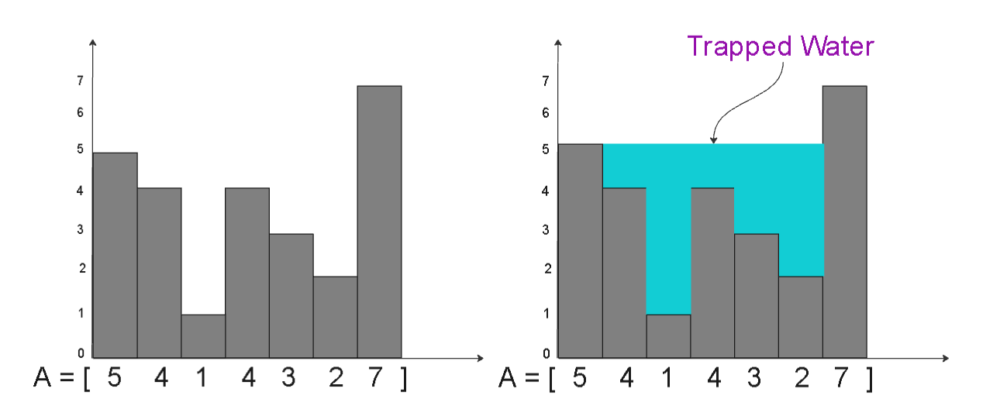

##  Max Sum Contiguous Subarray

Problem Description

Find the maximum sum of contiguous non-empty subarray within an array A of length N.


Problem Constraints

1 <= N <= 1e6
-1000 <= A[i] <= 1000


Input Format

The first and the only argument contains an integer array, A.


Output Format

Return an integer representing the maximum possible sum of the contiguous subarray.


Example Input

Input 1:

 A = [1, 2, 3, 4, -10] 
Input 2:

 A = [-2, 1, -3, 4, -1, 2, 1, -5, 4] 


Example Output

Output 1:

 10 
Output 2:

 6 


Example Explanation

Explanation 1:

 The subarray [1, 2, 3, 4] has the maximum possible sum of 10. 
Explanation 2:

 The subarray [4,-1,2,1] has the maximum possible sum of 6. 


Using Kadane's Algorithm

``` go
import "math"
func maxSubArray(A []int )  (int) {
    if len(A)==1{
        return A[0]
    }
    ans:=math.MinInt
    sum:=0
    for i:=0;i<len(A);i++{
        sum+=A[i]
        ans=max(ans,sum)

        if sum<=0{
            sum=0
        }
    }
    return ans
}

// required in go version before 1.18
func max(A int, B int)int{
    if A > B{
        return A
    }else{
        return B
    }
}
```

## Continuous Subarray

Problem Description

There are A beggars sitting in a row outside a temple. Each beggar initially has an empty pot. When the devotees come to the temple, they donate some amount of coins to these beggars. Each devotee gives a fixed amount of coin(according to their faith and ability) to some K beggars sitting next to each other.

Given the amount P donated by each devotee to the beggars ranging from L to R index, where 1 <= L <= R <= A, find out the final amount of money in each beggar's pot at the end of the day, provided they don't fill their pots by any other means.
For ith devotee B[i][0] = L, B[i][1] = R, B[i][2] = P, given by the 2D array B


Problem Constraints

1 <= A <= 2 * 105
1 <= L <= R <= A
1 <= P <= 103
0 <= len(B) <= 105


Input Format

The first argument is a single integer A.
The second argument is a 2D integer array B.


Output Format

Return an array(0 based indexing) that stores the total number of coins in each beggars pot.


Example Input

Input 1:-
A = 5
B = [[1, 2, 10], [2, 3, 20], [2, 5, 25]]


Example Output

Output 1:-
10 55 45 25 25


``` go

func solve(A int , B [][]int )  ([]int) {
    arr:=make([]int,A)

    for i:=0;i<len(B);i++{
        start:=B[i][0]-1
        end:=B[i][1]-1
        val:=B[i][2]
        
        arr[start]+=val
        if end+1<A{
            arr[end+1]+=-val
        }
    }

    
    for i:=1;i<len(arr);i++{
        arr[i]=arr[i-1]+arr[i]
    }
    return arr
}

```

## Rain Water Trapped

Problem Description

Imagine a histogram where the bars' heights are given by the array A. Each bar is of uniform width, which is 1 unit. When it rains, water will accumulate in the valleys between the bars.

Your task is to calculate the total amount of water that can be trapped in these valleys.

Example:

The Array A = [5, 4, 1, 4, 3, 2, 7] is visualized as below. The total amount of rain water trapped in A is 11.


Rain Water Trapped




Problem Constraints

1 <= |A| <= 105
0 <= A[i] <= 105


Input Format

First and only argument is the Integer Array, A.


Output Format

Return an Integer, denoting the total amount of water that can be trapped in these valleys


Example Input

Input 1:

 A = [0, 1, 0, 2]
Input 2:

A = [1, 2]


Example Output

Output 1:

1
Output 2:

0


Example Explanation

Explanation 1:

1 unit is trapped on top of the 3rd element.


Explanation 2:

No water is trapped.


## Add One To Number

Problem Description

Given a non-negative number represented as an array of digits, add 1 to the number ( increment the number represented by the digits ).


The digits are stored such that the most significant digit is at the head of the list.

NOTE: Certain things are intentionally left unclear in this question which you should practice asking the interviewer. For example: for this problem, the following are some good questions to ask :

Q: Can the input have 0's before the most significant digit. Or, in other words, is 0 1 2 3 a valid input?
A: For the purpose of this question, YES
Q: Can the output have 0's before the most significant digit? Or, in other words, is 0 1 2 4 a valid output?
A: For the purpose of this question, NO. Even if the input has zeroes before the most significant digit.


Problem Constraints

1 <= size of the array <= 1000000


Input Format

First argument is an array of digits.


Output Format

Return the array of digits after adding one.


Example Input

Input 1:

[1, 2, 3]


Example Output

Output 1:

[1, 2, 4]


Example Explanation

Explanation 1:

Given vector is [1, 2, 3].
The returned vector should be [1, 2, 4] as 123 + 1 = 124.

``` go

func reverse(A []int)[]int{
    var temp []int
    for i:=len(A)-1;i>=0;i--{
        temp = append(temp, A[i])
    }
    return temp
}

func plusOne(A []int )  ([]int) {
    var ans []int
    A=reverse(A)
    carry:=1
    
    for i:=0;i<len(A);i++{
        sum:=A[i]+carry
        ans = append(ans, sum%10)
        carry=sum/10
    }

    if carry>0{
        ans = append(ans, carry%10)
        carry/=10
    }
    for ans[len(ans)-1] == 0 && len(ans) > 1 {
		ans = ans[:len(ans)-1]
	}
	ans = reverse(ans)
	return ans
}

```

## Flip

Problem Description

You are given a binary string A(i.e., with characters 0 and 1) consisting of characters A1, A2, ..., AN. In a single operation, you can choose two indices, L and R, such that 1 ≤ L ≤ R ≤ N and flip the characters AL, AL+1, ..., AR. By flipping, we mean changing character 0 to 1 and vice-versa.


Your aim is to perform ATMOST one operation such that in the final string number of 1s is maximized.

If you don't want to perform the operation, return an empty array. Else, return an array consisting of two elements denoting L and R. If there are multiple solutions, return the lexicographically smallest pair of L and R.

NOTE: Pair (a, b) is lexicographically smaller than pair (c, d) if a < c or, if a == c and b < d.


Problem Constraints

1 <= size of string <= 100000


Input Format

First and only argument is a string A.


Output Format

Return an array of integers denoting the answer.


Example Input

Input 1:

A = "010"
Input 2:

A = "111"


Example Output

Output 1:

[1, 1]
Output 2:

[]


Example Explanation

Explanation 1:

A = "010"

Pair of [L, R] | Final string
_______________|_____________
[1 1]          | "110"
[1 2]          | "100"
[1 3]          | "101"
[2 2]          | "000"
[2 3]          | "001"

We see that two pairs [1, 1] and [1, 3] give same number of 1s in final string. So, we return [1, 1].
Explanation 2:

No operation can give us more than three 1s in final string. So, we return empty array [].

``` go

import "strings"
func flip(A string )  ([]int) {
    B := strings.Split(A, "")
	csum := 0
	maxsum := 0
	l := 0
	r := 0
	ans := make([]int, 2)
	for i := 0; i < len(B); i++ {

		if B[i] == "0" {
			csum += 1
		} else {
			csum -= 1
		}
        if csum > maxsum{
            maxsum=csum
            ans[0]=l+1
            ans[1]=r+1
        }
        if csum<0{
            csum=0
            l=i+1
            r=i+1
        }else{
            r=i+1
        }
    }
    if maxsum==0{
        var an []int
        return an
    }else{
        return ans
    }

    
}
```