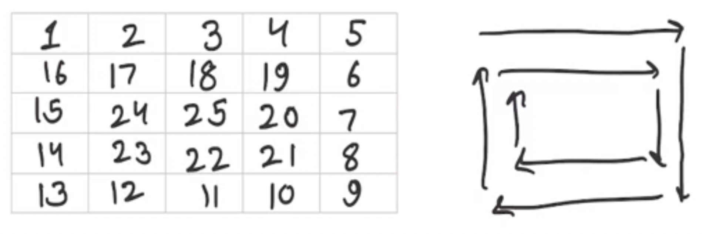

## Search in a row wise and column wise sorted matrix

Problem Description

Given a matrix of integers A of size N x M and an integer B.

In the given matrix every row and column is sorted in non-decreasing order. Find and return the position of B in the matrix in the given form:
```
If A[i][j] = B then return (i * 1009 + j)
If B is not present return -1.
```
Note 1: Rows are numbered from top to bottom and columns are numbered from left to right.
Note 2: If there are multiple B in A then return the smallest value of i*1009 +j such that A[i][j]=B.
Note 3: Expected time complexity is linear
Note 4: Use 1-based indexing


Problem Constraints
```
1 <= N, M <= 1000
-100000 <= A[i] <= 100000
-100000 <= B <= 100000
```

Input Format

The first argument given is the integer matrix A.
The second argument given is the integer B.


Output Format

Return the position of B and if it is not present in A return -1 instead.


Example Input
```
Input 1:-
A = [[1, 2, 3]
     [4, 5, 6]
     [7, 8, 9]]
B = 2
```
```
Input 2:-
A = [[1, 2]
     [3, 3]]
B = 3
```

Example Output

```
Output 1:-
1011
Output 2:-
2019
```

Example Explanation

Expanation 1:-
```
A[1][2] = 2
1 * 1009 + 2 = 1011
```
Explanation 2:-
```
A[2][1] = 3
2 * 1009 + 1 = 2019
```
```
A[2][2] = 3
2 * 1009 + 2 = 2020
The minimum value is 2019
```


## Spiral Order Matrix II

Problem Description

Given an integer A, generate a square matrix filled with elements from 1 to A2 in spiral order and return the generated square matrix.


Problem Constraints

1 <= A <= 1000


Input Format

First and only argument is integer A


Output Format

Return a 2-D matrix which consists of the elements added in spiral order.

```
Example Input

Input 1:

1
Input 2:

2
Input 3:

5
```
```
Example Output

Output 1:

[ [1] ]
Output 2:

[ [1, 2], 
  [4, 3] ]
Output 3:

[ [1,   2,  3,  4, 5], 
  [16, 17, 18, 19, 6], 
  [15, 24, 25, 20, 7], 
  [14, 23, 22, 21, 8], 
  [13, 12, 11, 10, 9] ]
```

```
Example Explanation

Explanation 1:

Only 1 is to be arranged.
Explanation 2:

1 --> 2
      |
      |
4<--- 3
Explanation 3:
```


## Row to Column Zero

Problem Description

You are given a 2D integer matrix A, make all the elements in a row or column zero if the A[i][j] = 0. Specifically, make entire ith row and jth column zero.


Problem Constraints

1 <= A.size() <= 103

1 <= A[i].size() <= 103

0 <= A[i][j] <= 103


Input Format

First argument is a 2D integer matrix A.


Output Format

Return a 2D matrix after doing required operations.


Example Input
```
Input 1:

[1,2,3,4]
[5,6,7,0]
[9,2,0,4]


Example Output

Output 1:

[1,2,0,0]
[0,0,0,0]
[0,0,0,0]
```

Example Explanation

Explanation 1:

A[2][4] = A[3][3] = 0, so make 2nd row, 3rd row, 3rd column and 4th column zero.

## Sub-matrix Sum Queries

Problem Description

Given a matrix of integers A of size N x M and multiple queries Q, for each query, find and return the submatrix sum.


Inputs to queries are top left (b, c) and bottom right (d, e) indexes of submatrix whose sum is to find out.

NOTE:

Rows are numbered from top to bottom, and columns are numbered from left to right.
The sum may be large, so return the answer mod 109 + 7.
Also, select the data type carefully, if you want to store the addition of some elements.
Indexing given in B, C, D, and E arrays is 1-based.
Top Left 0-based index = (B[i] - 1, C[i] - 1)
Bottom Right 0-based index = (D[i] - 1, E[i] - 1)

Problem Constraints

1 <= N, M <= 1000
-100000 <= A[i] <= 100000
1 <= Q <= 100000
1 <= B[i] <= D[i] <= N
1 <= C[i] <= E[i] <= M


Input Format

The first argument given is the integer matrix A.
The second argument given is the integer array B.
The third argument given is the integer array C.
The fourth argument given is the integer array D.
The fifth argument given is the integer array E.
(B[i], C[i]) represents the top left corner of the i'th query.
(D[i], E[i]) represents the bottom right corner of the i'th query.


Output Format

Return an integer array containing the submatrix sum for each query.


Example Input
```
Input 1:

 A = [   [1, 2, 3]
         [4, 5, 6]
         [7, 8, 9]   ]
 B = [1, 2]
 C = [1, 2]
 D = [2, 3]
 E = [2, 3]
Input 2:

 A = [   [5, 17, 100, 11]
         [0, 0,  2,   8]    ]
 B = [1, 1]
 C = [1, 4]
 D = [2, 2]
 E = [2, 4]
```

Example Output

Output 1:

 [12, 28]
Output 2:

 [22, 19]


Example Explanation

Explanation 1:

 For query 1: Submatrix contains elements: 1, 2, 4 and 5. So, their sum is 12.
 For query 2: Submatrix contains elements: 5, 6, 8 and 9. So, their sum is 28.
Explanation 2:

 For query 1: Submatrix contains elements: 5, 17, 0 and 0. So, their sum is 22.
 For query 2: Submatrix contains elements: 11 and 8. So, their sum is 19.
 
 ``` go
func prefixMatrixSum(A [][]int) ([][]int){
    n := len(A)
    m := len(A[0])
    arr := make([][]int, n + 1)
    for i := range arr {
        arr[i] = make([]int, m + 1)
    }
    for i := 0; i < m; i++ {
        arr[1][i + 1] = A[0][i] 
    }
    //Do column wise sum
    for i := 1; i < n; i++ {
        for j := 0; j < m; j++ {
            arr[i + 1][j + 1] = A[i][j] + arr[i][j + 1]
        }
    }
    
    //Do row wise sum
    for i := 0; i < n; i++ {
        for j := 1; j < m; j++ {
            arr[i + 1][j + 1] += arr[i + 1][j]
        }
    }
    
    return arr
}
func solve(A [][]int , B []int , C []int , D []int , E []int )  ([]int) {
    q := len(B)
    arr := prefixMatrixSum(A)
    var v []int
    const mod int = 1e9 + 7
    for i := 0; i < q; i++ {
        x1, y1, x2, y2 := B[i], C[i], D[i], E[i]
        ans := arr[x2][y2] - arr[x2][y1 - 1] - arr[x1 - 1][y2] + arr[x1 - 1][y1 - 1]
        for ans < 0 {
            ans += mod
        }
        ans %= mod
        v = append(v, ans)
    }
    return v
}
 ```

 ## Sum of all Submatrices

 Problem Description

Given a 2D Matrix A of dimensions N*N, we need to return the sum of all possible submatrices.


Problem Constraints

1 <= N <=30

0 <= A[i][j] <= 10


Input Format

Single argument representing a 2-D array A of size N x N.


Output Format

Return an integer denoting the sum of all possible submatrices in the given matrix.


Example Input

Input 1:
A = [ [1, 1]
      [1, 1] ]
Input 2:
A = [ [1, 2]
      [3, 4] ]


Example Output

Output 1:
16
Output 2:
40


Example Explanation

Example 1:
Number of submatrices with 1 elements = 4, so sum of all such submatrices = 4 * 1 = 4
Number of submatrices with 2 elements = 4, so sum of all such submatrices = 4 * 2 = 8
Number of submatrices with 3 elements = 0
Number of submatrices with 4 elements = 1, so sum of such submatrix = 4
Total Sum = 4+8+4 = 16
Example 2:
The submatrices are [1], [2], [3], [4], [1, 2], [3, 4], [1, 3], [2, 4] and [[1, 2], [3, 4]].
Total sum = 40

``` go

func solve(A [][]int )  (int) {
    ans:=0
    for i:=0;i<len(A);i++{
        for j:=0;j<len(A[i]);j++{
            ans+=A[i][j]*(i+1)*(j+1)*(len(A)-i)*(len(A[i])-j)
        }
    }
    return ans
}

```

## Maximum Submatrix Sum

Problem Description

Given a row-wise and column-wise sorted matrix A of size N * M.
Return the maximum non-empty submatrix sum of this matrix.


Problem Constraints

1 <= N, M <= 1000
-109 <= A[i][j] <= 109


Input Format

The first argument is a 2D integer array A.


Output Format

Return a single integer that is the maximum non-empty submatrix sum of this matrix.


Example Input
```
Input 1:-
    -5 -4 -3
A = -1  2  3
     2  2  4
Input 2:-
    1 2 3
A = 4 5 6
    7 8 9
```

Example Output

Output 1:-
12
Output 2:-
45


Example Explanation
```
Expanation 1:-
The submatrix with max sum is 
-1 2 3
 2 2 4
 Sum is 12.
Explanation 2:-
The largest submatrix with max sum is 
1 2 3
4 5 6
7 8 9
The sum is 45.
```


## Minimum Swaps

Problem Description

Given an array of integers A and an integer B, find and return the minimum number of swaps required to bring all the numbers less than or equal to B together.

Note: It is possible to swap any two elements, not necessarily consecutive.


Problem Constraints

1 <= length of the array <= 100000
-109 <= A[i], B <= 109


Input Format

The first argument given is the integer array A.
The second argument given is the integer B.


Output Format

Return the minimum number of swaps.


Example Input
```
Input 1:

 A = [1, 12, 10, 3, 14, 10, 5]
 B = 8
Input 2:

 A = [5, 17, 100, 11]
 B = 20
```

Example Output

Output 1:

 2
Output 2:

 1

 ```
 Example Explanation

Explanation 1:

 A = [1, 12, 10, 3, 14, 10, 5]
 After swapping  12 and 3, A => [1, 3, 10, 12, 14, 10, 5].
 After swapping  the first occurence of 10 and 5, A => [1, 3, 5, 12, 14, 10, 10].
 Now, all elements less than or equal to 8 are together.
Explanation 2:

 A = [5, 17, 100, 11]
 After swapping 100 and 11, A => [5, 17, 11, 100].
 Now, all elements less than or equal to 20 are together.
 
 ```

 ## Row with maximum number of ones

 Problem Description

Given a binary sorted matrix A of size N x N. Find the row with the maximum number of 1.

NOTE:

If two rows have the maximum number of 1 then return the row which has a lower index.
Rows are numbered from top to bottom and columns are numbered from left to right.
Assume 0-based indexing.
Assume each row to be sorted by values.
Expected time complexity is O(rows + columns).


Problem Constraints

1 <= N <= 1000

0 <= A[i] <= 1


Input Format

The only argument given is the integer matrix A.


Output Format

Return the row with the maximum number of 1.


Example Input
```
Input 1:

 A = [   [0, 1, 1]
         [0, 0, 1]
         [0, 1, 1]   ]
Input 2:

 A = [   [0, 0, 0, 0]
         [0, 0, 0, 1]
         [0, 0, 1, 1]
         [0, 1, 1, 1]    ]


Example Output

Output 1:

 0
Output 2:

 3


Example Explanation

Explanation 1:

 Row 0 has maximum number of 1s.
Explanation 2:

 Row 3 has maximum number of 1s.

 ```

 ``` go
 func solve(A [][]int )  (int) {
    ans:=0
    index:=0
    for i:=0;i<len(A);i++{
        sum:=0
        for j:=0;j<len(A[i]);j++{
            if A[i][j]==1{
                sum++
            }
            if ans<sum{
                ans=sum
                index=i
            }
        }
    }
    return index
}
```