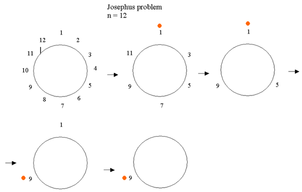

>## Length of longest consecutive ones ##

Given a binary string A. It is allowed to do at most one swap between any 0 and 1. Find and return the length of the longest consecutive 1’s that can be achieved.

Input Format

The only argument given is string A.
Output Format

Return the length of the longest consecutive 1’s that can be achieved.
Constraints

1 <= length of string <= 1000000
A contains only characters 0 and 1.
For Example

Input 1:
    A = "111000"
Output 1:
    3

Input 2:
    A = "111011101"
Output 2:
    7

## Count Increasing Triplets ##

Problem Description

You are given an array A of N elements. Find the number of triplets i,j and k such that  i < j < k and A[i] < A[j] < A[k]

Problem Constraints

1 <= N <= 103
1 <= A[i] <= 109

Input Format

First argument A is an array of integers.

Output Format

Return an integer.

Example Input

Input 1:
A = [1, 2, 4, 3]
Input 2:
A = [2, 1, 2, 3]

Example Output

Output 1:
2
Output 2:
1

Example Explanation

For Input 1:
The triplets that satisfy the conditions are [1, 2, 3] and [1, 2, 4].
For Input 2:
 
The triplet that satisfy the conditions is [1, 2, 3].

## Josephus Problem - 2 ##

Problem Description

There are A people standing in a circle. Person 1 kills their immediate clockwise neighbour and pass the knife to the next person standing in circle. This process continues till there is only 1 person remaining. Find the last person standing in the circle.

Problem Constraints

1 <= A <= 105

Input Format

First argument A is an integer.

Output Format

Return an integer.

Example Input

Input 1:
A = 4
Input 2:
A = 5

Example Output

Output 1:
1
Output 2:
3

## Spider's Web ##

A spider is trying to build a web for itself. The web built by it doubles every day.

If the spider entirely built the web in 15 days, how many days did it take for the spider to build 25% of the web?

Answer is an integer. Just put the number without any decimal places if it's an integer. If the answer is Infinity, output Infinity.

>Given that Spider doubles its work every day let’s figure out the amount of work done till the 14th day ( a day before 15 days ).
Let’s say the work done till the 14th day is X. Spider doubled the work done till the 14th on 15th. On day 15th, Spider did X more work.

>We know that 2X = 100% work.
Which means X = 50% work.

>The Spider built 50% of the web till the 14th day.
If you extend it, the Spider did 25% of the work till the 13th day.

## Multiple left rotations of the array ##

Problem Description

Given an array of integers A and multiple values in B, which represents the number of times array A needs to be left rotated.

Find the rotated array for each value and return the result in the from of a matrix where ith row represents the rotated array for the ith value in B.

Problem Constraints

1 <= length of both arrays <= 2000 -10^9 <= A[i] <= 10^9 0 <= B[i] <= 2000

Input Format

The first argument given is the integer array A.
The second argument given is the integer array B.

Output Format

Return the resultant matrix.

Example Input

Input 1:
 
    A = [1, 2, 3, 4, 5]
    B = [2, 3]

Input 2:

  
    A = [5, 17, 100, 11]
    B = [1]

Example Output

Output 1:
 
    [ [3, 4, 5, 1, 2]
     [4, 5, 1, 2, 3] ]

Output 2:

    
    [ [17, 100, 11, 5] ]

## Multiple left rotations of the array

Problem Description

Given an array of integers A and multiple values in B, which represents the number of times array A needs to be left rotated.

Find the rotated array for each value and return the result in the from of a matrix where ith row represents the rotated array for the ith value in B

Problem Constraints

1 <= length of both arrays <= 2000 -10^9 <= A[i] <= 10^9 0 <= B[i] <= 2000

Input Format

The first argument given is the integer array A.
The second argument given is the integer array B.

Output Format

Return the resultant matrix.

Example Input

Input 1:
 
    A = [1, 2, 3, 4, 5]
    B = [2, 3]

Input 2:

  
    A = [5, 17, 100, 11]
    B = [1]

Example Output

Output 1:
 
    [ [3, 4, 5, 1, 2]
     [4, 5, 1, 2, 3] ]

Output 2:

    
    [ [17, 100, 11, 5] ]

Example Explanation

for input 1 -> B[0] = 2 which requires 2 times left rotations

1: [2, 3, 4, 5, 1]

2: [3, 4, 5, 1, 2]

B[1] = 3 which requires 3 times left rotation

1: [2, 3, 4, 5, 1]

2: [3, 4, 5, 1, 2]

2: [4, 5, 1, 2, 4]

## Ratio of Boys and Girls

>In a country where everyone wants a boy, each family continues having babies till they have a boy. After a long time, what is the proportion of boys to girls in the country? (Assuming probability of having a boy or a girl is the same) > Round off your answer to two decimal places and output the answer as I.xx where I is the integer part of your answer, and xx is the first two decimal places of the rounded-off answer.

Sol > Let P be the probability that a child is girl and (1-P) be probability that a child is boy.
Since the probability of having a boy or a girl is the same, so both P and (1-P) is 1/2.

Let G denote a girl and B denote a boy. Then the possible configuration of chilren are B, GB, GGB, GGGB, GGGGB and so on.

Let N be the expected no. of girls before a boy is born

    N = 0*(Probability of B) + 1*(Probability of GB) + 2*(Probability of GGB) + ...
    N = 0*(1-P) + 1*P*(1-P) + 2*P*P*(1-P) + ...

    N = 0*(1/2) + 1*(1/2)2 + 2*(1/2)3 + ... 
    (1/2)*N = 0*(1/2)2 + 1*(1/2)3 + 2*(1/2)4 + ... (Dividing both sides by 1/2)

    Subtracting the above two equations,
    N - (1/2)*N = 1*(1/2)2 + 1*(1/2)3 + 1*(1/2)4 + ...
    (1/2)*N = (1/4)/(1 - 1/2) = 1/2 (using sum formula of infinite GP with ratio less than 1)
    N = 1
So the expected number of number of girls = 1
Since the expected number of girls is 1 and there is always a baby boy, the expected ratio of boys and girls is 1:1
Thus the answer will be 1.00

## 100 People in a Circle

One hundred people are standing in a circle in an order 1 to 100.

No.1 has a sword. He kills the next person (i.e., no. 2) and gives the sword to the next (i.e., no. 3). All person does the same until only one survives.

Which number survives at last?

Answer is an integer. Just put the number without any decimal places if it's an integer. If the answer is Infinity, output Infinity.

> See Intermediate2\pdfs\Intermediate2InterviewQuestions.pdf for desc

73